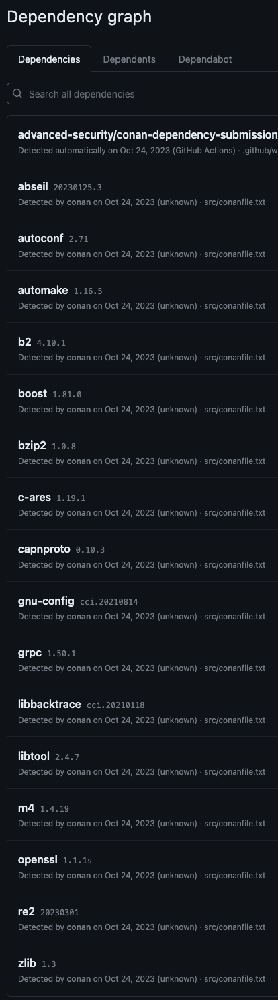

# Conan Dependency Submission for GitHub

> [!NOTE]
> This is an _unofficial_ tool created by Field Security Services, and is not officially supported by GitHub.

This repository contains a GitHub Action that can be used to submit details of a [Conan](https://conan.io/) package to GitHub's [Dependency Graph](https://docs.github.com/en/enterprise-cloud@latest/code-security/supply-chain-security/understanding-your-software-supply-chain/about-the-dependency-graph).

> 💡 Using this Action will not yet give you Dependabot alerts or updates for Conan packages. Dependency Review support is also limited. See the FAQ below for more details.

This can let you see what packages your project depends on in GitHub's Insights, and can be used to generate a Software Bill of Materials (SBOM) for your project.

It also allows [Dependency Review](https://github.com/marketplace/actions/dependency-review) to show changed packages in a PR. Checks based on their license and name are not yet possible.

## Results

This is an example of the results of using this Action:



## Actions Usage

To use this action, add the following step to your workflow:

```yaml
uses: advanced-security/conan-dependency-submission@v1
```

### Inputs

These are all optional, and have defaults or are auto-discovered.

| Name | Description | Default |
| ---- | ----------- | ------- |
| `target` | Target directory | Root of repository |
| `github-server` | GitHub server to use | `github.com` |
| `conan-config` | Path to Conan configuration file (git/http/folder) | None |
| `conan-profile` | Name of Conan profile to use | `default` |
| `conanfile` | Path to `conanfile.py` or `conanfile.txt` | Auto-discovered |
| `python-version` | Python version to use | `3.10` |
| `conan-version` | Conan version to use | `2.0.8` |

If you do not specifiy a `conanfile`, then the action will look for `conanfile.py` or `conanfile.txt` in the target repository.

If you are using GitHub Enterprise Server, you will need to set the `github-server` input to the hostname of your server.

If a `conan-profile` is not provided, then a `default` profile will be auto-generated by Conan and then used, based on the environment of the Actions runner.

Where a `target` is not set, the root of the repository will be used.

### Example step with inputs

```yaml
uses: advanced-security/conan-dependency-submission@v1
with:
  target: 'src'
  github-server: 'github.example.invalid'
  conan-config: "./conan-config"
  conan-profile: 'myprofile'
  conanfile: 'src/conanfile.py'
  python-version: '3.9'
  conan-version: '1.40.0'
```

### Sample starter workflow

[starter-workflow.yml](starter-workflow.yml) is a sample workflow that uses this action.

## Command Line Usage

```bash
./conan_submit.py --help
usage: conan_submit.py [-h] [--target TARGET] [--github-server GITHUB_SERVER] [--conan-path CONAN_PATH] [--conan-profile CONAN_PROFILE] [--conanfile CONANFILE] [--graphfile GRAPHFILE] [--debug] [--dry-run] repo

Generate a graph from Conan packages, and submit to the GitHub Dependency Graph using the Submission API.

positional arguments:
  repo                  GitHub repository path

options:
  -h, --help            show this help message and exit
  --target TARGET       Target directory for Conan package
  --github-server GITHUB_SERVER
                        GitHub server
  --conan-path CONAN_PATH
                        Path to conan executable
  --conan-profile CONAN_PROFILE
                        Name of Conan profile to use
  --conanfile CONANFILE
                        Path to conanfile.py or conanfile.txt
  --graphfile GRAPHFILE
                        Path to pre-made Conan graph JSON file
  --sha SHA             Commit SHA to use for graph submission
  --debug, -d           Enable debug output
  --dry-run             Do not submit to GitHub server - just a dry-run
```

## FAQ

### Why is this needed?

GitHub's Dependency Graph is a great way to see what packages your project depends on. However, by default it only works for supported packages that are understood statically, which doesn't include `conanfile.txt` nor `conanfile.py`.

### Where does it get platform specific details from?

First, note that platform-specific details are currently not retained by Dependency Graph, but are submitted.

It uses the Actions runner to run `conan`, and by default it takes details from there, automatically building a default profile for Conan.

If you do not want to use these details, then you can provide your own Conan configuration and choose a profile from there, or use an Actions runner that is the same platform as your build system, to ensure a match.

### Dependabot isn't showing any alerts - why?

Dependabot needs to know about an ecosytem before it can show alerts for it. At the time of writing, it doesn't support Conan.

Dependabot also only shows alerts for curated advisories in the [GitHub Advisory Database](https://github.com/advisories), and at present there are none for Conan packages.

### Dependency Review has problems - what's wrong?

Dependency Graph does not accept submissions of license information for Conan packages, so Dependency Review cannot show license information.

The `license` key is set in the Conan PURL, but Dependency Graph does not extract that at present.

### What use can I make of this if Dependabot doesn't support Conan, and Dependency Review's support is only partial?

There are workarounds you can use to match Dependency Graph content to local advisories, such as by using the [GitHub Field GHAS Toolkit](https://github.com/GeekMasher/ghas-toolkit).

It's also a way of generating a Software Bill of Materials (SBOM) for your project.

[Dependency Review](https://github.com/marketplace/actions/dependency-review) also works with the Dependency Graph, and can be used show changed packages at PR.

### How did you decide what to submit?

We looked at the [Package URL specification](https://github.com/package-url/purl-spec/blob/master/PURL-TYPES.rst#conan) and the [Dependency Submission API](https://docs.github.com/en/enterprise-cloud@latest/rest/dependency-graph/dependency-submission?apiVersion=2022-11-28), and matched the two up.

### How does this Action do what it does?

Conan uses a [central index](https://github.com/conan-io/conan-center-index) of packages. This is used by the `conan` client to find packages.

This Action installs the `conan` tool, wraps it, parses the results of inspecting a [`conanfile`](https://docs.conan.io/2/reference/conanfile/attributes.html), and submits them to the [Dependency Submission API](https://docs.github.com/en/code-security/supply-chain-security/understanding-your-software-supply-chain/using-the-dependency-submission-api).

## License

This project is licensed under the terms of the MIT open source license. Please refer to the [LICENSE](LICENSE) for the full terms.

## Maintainers

See [CODEOWNERS](CODEOWNERS) for the list of maintainers.

## Support

> [!NOTE]
> This is an _unofficial_ tool created by Field Security Services, and is not officially supported by GitHub.

See the [SUPPORT](SUPPORT.md) file.

## Background

See the [CHANGELOG](CHANGELOG.md), [CONTRIBUTING](CONTRIBUTING.md), [SECURITY](SECURITY.md), [SUPPORT](SUPPORT.md), [CODE OF CONDUCT](CODE_OF_CONDUCT.md) and [PRIVACY](PRIVACY.md) files for more information.
